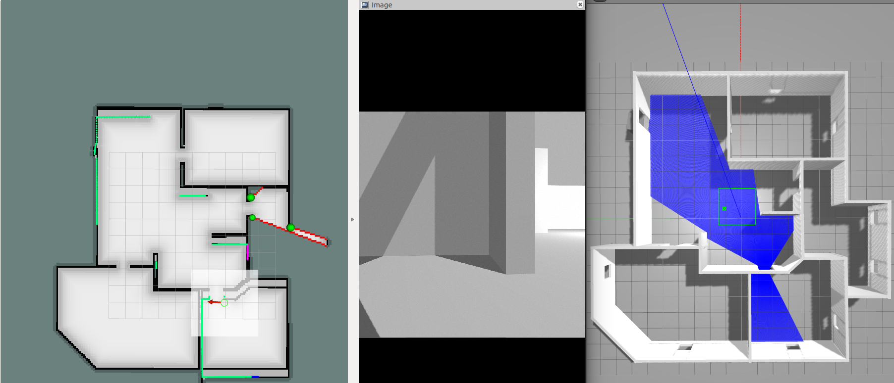

# Fire fighting robot
By [Lidor Shimoni](https://github.com/lidorshimoni), [Daniel Angel](https://github.com/danielengel111)

* Uses SLAM to map its surrounding
* Autonomously exploring
* Recognizes fire and trapped peoples and marks their location on the map
<!-- ## Example
[](https://youtu.be/CvRHvVOhvw0) -->

## Example



## Running in simulation
For a simulation with joystick controller use:


```
roslaunch joystick_slam.launch
```


For a simulation with move_base controller use:


```
roslaunch move_base_slam.launch
```

For autonomous exploration use:


```
roslaunch lite_exploration.launch
```


## Dependencies
The following dependencies are required:
* python 3.X
* python3-opencv
* teb_local_planner as move_base -> local_planner
* GlobalPlanner as move_base -> global_planner
* diffdrive
* frontier_exploration
### Optional
* Explore_lite
<!-- ## Refrences -->
